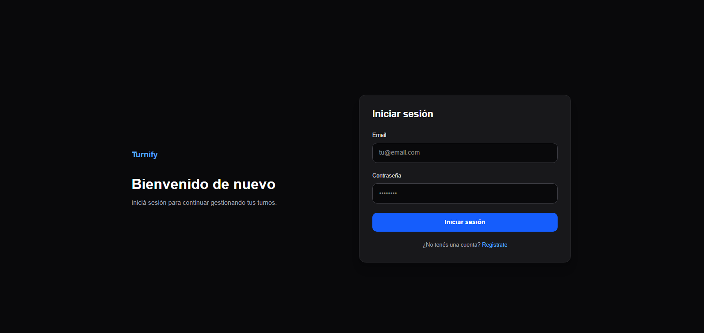
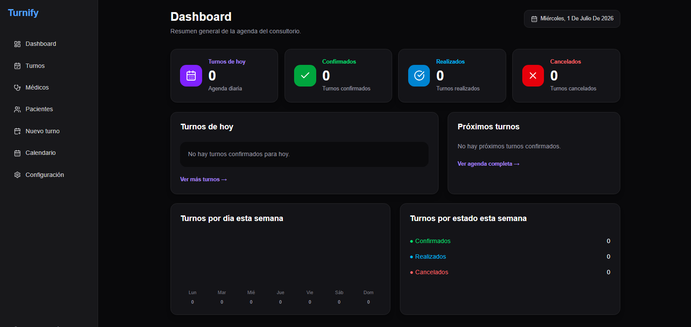
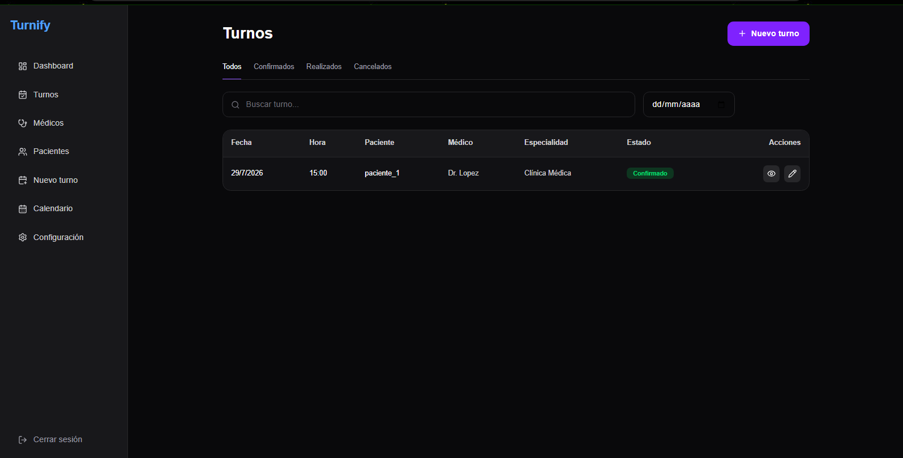
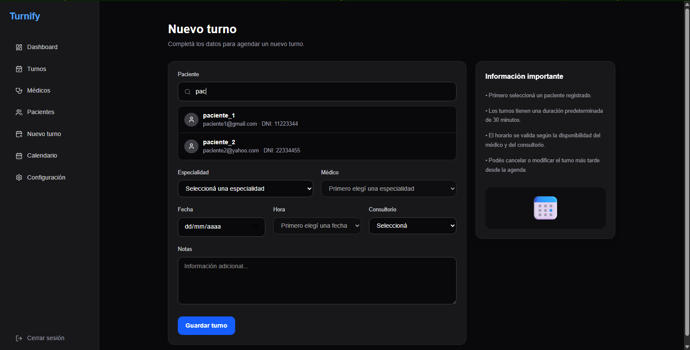
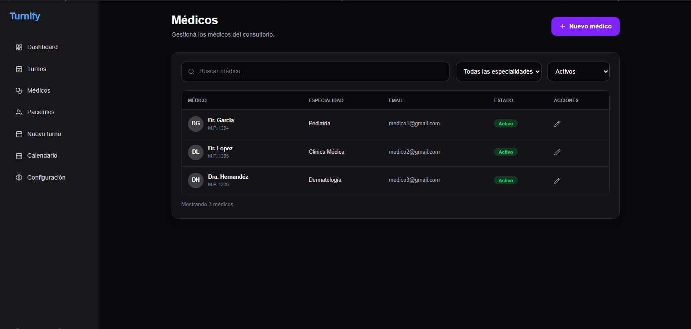
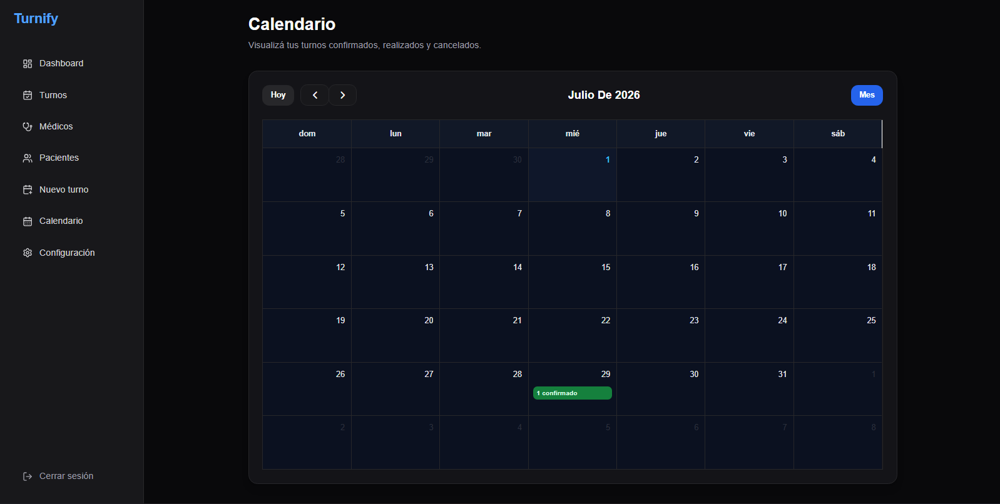

<div align="center">

# 🩺 Turnify

### Sistema de Gestión de Turnos Médicos

Aplicación web desarrollada con **Next.js**, **TypeScript** y **Supabase** para administrar consultorios médicos de forma moderna, segura y completamente multiusuario.


</div>

---

# 📖 Descripción

Turnify es una plataforma web para la gestión de turnos médicos.

Cada profesional posee su propia cuenta y administra únicamente:

- 👨‍⚕️ Médicos
- 👥 Pacientes
- 📅 Turnos
- 📊 Estadísticas
- 📆 Calendario

Toda la información permanece aislada mediante autenticación y políticas de seguridad.

---

# ✨ Características

- Registro e inicio de sesión
- Dashboard con estadísticas
- Gestión de pacientes
- Gestión de médicos
- Gestión de turnos
- Calendario interactivo
- Búsqueda inteligente
- Estados de turnos
- Sistema multiusuario
- Responsive Design

---

# 📸 Capturas

## Login



---

## Dashboard



---

## Turnos



---

## Pacientes



---

## Médicos



---

## Calendario



---

# 🏗 Arquitectura

```text
                  Usuario
                     │
                     ▼
        ┌────────────────────────┐
        │     Next.js App Router │
        └────────────────────────┘
                     │
      ┌──────────────┴──────────────┐
      │                             │
 Server Components          Client Components
      │                             │
      └──────────────┬──────────────┘
                     │
              Supabase Auth
                     │
               PostgreSQL
```

---

# 🗄 Modelo de datos

```text
                    USERS
                      │
                  user_id
                      │
        ┌─────────────┼─────────────┐
        ▼             ▼             ▼

     PATIENTS      DOCTORS     APPOINTMENTS
        │             │             │
        └────── patient_id ─────────┘
                      │
                 doctor_id
```

---

# 🔒 Seguridad

El sistema implementa:

- Autenticación mediante Supabase Auth
- Server Side Authentication (SSR)
- Row Level Security (RLS)
- Protección de rutas privadas
- Validación de formularios
- Validación de correos
- Separación completa de datos por usuario

Cada registro almacena:

```text
user_id
```

permitiendo que cada profesional visualice únicamente su propia información.

---

# 📊 Dashboard

El Dashboard presenta información resumida del consultorio.

Incluye:

- Turnos del día
- Confirmados
- Realizados
- Cancelados
- Próximos turnos
- Agenda diaria
- Estadísticas semanales

---

# 👨‍⚕️ Gestión de Médicos

Permite:

- Registrar médicos
- Editar información
- Activar/Desactivar
- Especialidades

Cada médico pertenece únicamente al usuario autenticado.

---

# 👥 Gestión de Pacientes

Permite:

- Alta de pacientes
- Modificación
- Búsqueda
- Asociación con turnos

Los pacientes son privados para cada cuenta.

---

# 📅 Gestión de Turnos

Funciones disponibles:

- Crear turno
- Editar turno
- Cancelar turno
- Marcar como realizado
- Consultar detalle

Estados:

- Confirmado
- Realizado
- Cancelado

No existen estados pendientes.

Los turnos cancelados no pueden reactivarse.

El sistema impide reservar dos turnos para un mismo médico en el mismo horario.

---

# 📆 Calendario

El calendario permite visualizar la agenda mensual.

Cada día muestra:

- Cantidad de turnos confirmados
- Cantidad de realizados
- Cantidad de cancelados

Al seleccionar un día se accede directamente a los turnos filtrados de esa fecha.

---

# ⚙ Tecnologías

| Tecnología | Función |
|------------|---------|
| Next.js | Framework |
| React | Componentes |
| TypeScript | Tipado |
| Tailwind CSS | Estilos |
| Supabase | Backend |
| PostgreSQL | Base de datos |
| FullCalendar | Calendario |
| Lucide React | Iconografía |

---

# 📂 Estructura del proyecto

```text
src
│
├── app
│   ├── dashboard
│   ├── appointments
│   ├── doctors
│   ├── patients
│   ├── calendar
│   ├── login
│   └── register
│
├── components
│   ├── calendar
│   ├── AuthGuard
│   ├── AppLayout
│   └── ...
│
├── lib
│   ├── supabase.ts
│   ├── supabaseBrowser.ts
│   └── supabaseServer.ts
│
└── public
```

---

# 🚀 Instalación

## Clonar

```bash
git clone https://github.com/TU_USUARIO/turnify.git
```

## Instalar

```bash
npm install
```

## Variables de entorno

Crear un archivo `.env.local`

```env
NEXT_PUBLIC_SUPABASE_URL=TU_URL
NEXT_PUBLIC_SUPABASE_PUBLISHABLE_KEY=TU_ANON_KEY
```

## Ejecutar

```bash
npm run dev
```

---

# 🔮 Próximas mejoras

- Recordatorios por correo electrónico
- Notificaciones por WhatsApp
- Horarios configurables por médico
- Múltiples consultorios
- Exportación PDF
- Reportes avanzados
- Historia clínica
- Obras sociales
- Roles (Administrador, Secretario y Médico)
- Despliegue en Vercel

---

# 👨‍💻 Autor

**Turnify**

Proyecto desarrollado como sistema de gestión de turnos médicos utilizando **Next.js**, **Supabase** y **TypeScript**.
## Deploy on Vercel

The easiest way to deploy your Next.js app is to use the [Vercel Platform](https://vercel.com/new?utm_medium=default-template&filter=next.js&utm_source=create-next-app&utm_campaign=create-next-app-readme) from the creators of Next.js.

Check out our [Next.js deployment documentation](https://nextjs.org/docs/app/building-your-application/deploying) for more details.
