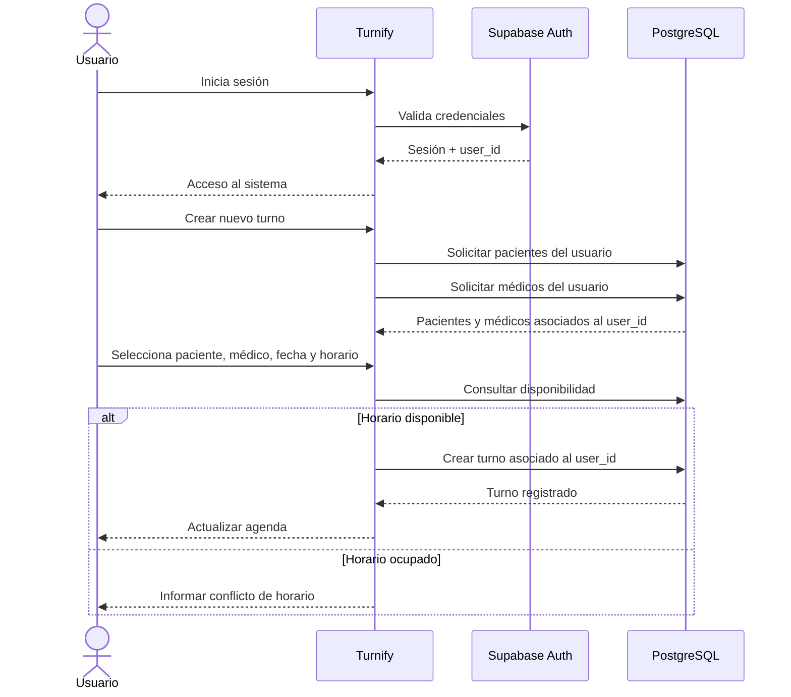
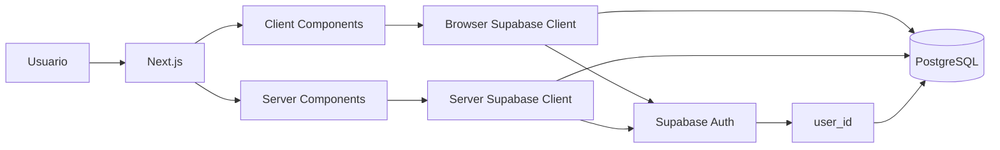
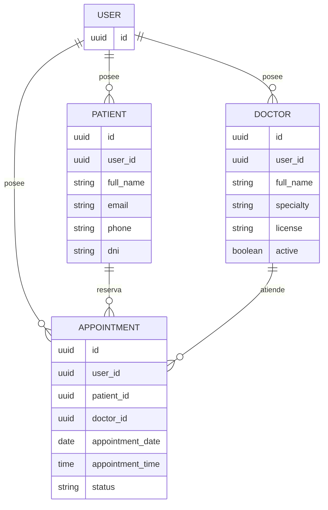

<div align="center">

# 🩺 Turnify

### Sistema web multiusuario para la gestión de turnos médicos

Turnify centraliza la administración de **pacientes, médicos y turnos** de un consultorio en una única aplicación, incorporando autenticación, agenda, calendario y estadísticas.

Desarrollado con **Next.js · TypeScript · Supabase · PostgreSQL**

**[🚀 Ver demo online](https://turnify-five.vercel.app)**

</div>

---

# 📖 ¿Qué es Turnify?

Turnify es una aplicación web desarrollada para simplificar la administración diaria de un consultorio médico.

El problema que busca resolver no es solamente registrar una cita. La gestión de una agenda implica relacionar pacientes con profesionales, controlar horarios disponibles, conocer el estado de cada atención y poder consultar rápidamente qué ocurrió o qué ocurrirá durante el día.

Por este motivo, Turnify integra toda esa información dentro de un mismo sistema.

Un usuario puede crear su cuenta, registrar los médicos con los que trabaja, cargar sus pacientes y posteriormente utilizar esos datos para administrar los turnos. La información puede consultarse desde una agenda tradicional, desde un calendario mensual o desde un dashboard que resume el estado actual del consultorio.

Uno de los aspectos más importantes del proyecto es que fue diseñado como un **sistema multiusuario**. Cada cuenta posee su propio espacio de trabajo y administra únicamente sus médicos, pacientes y turnos.

```text
Rocío
├── Médicos
├── Pacientes
└── Turnos

Juan
├── Médicos
├── Pacientes
└── Turnos
```

Aunque ambas cuentas utilizan la misma aplicación y base de datos, Turnify utiliza la identidad proporcionada por Supabase Auth para mantener la información separada.

---

# 🎯 Del problema a la solución

Una agenda médica comienza siendo sencilla, pero aumenta rápidamente su complejidad cuando aparecen múltiples profesionales, pacientes recurrentes, cancelaciones y consultas sobre disponibilidad.

Turnify busca que el administrador pueda responder desde un único lugar preguntas cotidianas como **qué turnos tengo hoy, quién será atendido, con qué profesional, qué horarios siguen disponibles y qué ocurrió con las citas anteriores**.

Para conseguirlo, el sistema no trata pacientes, médicos y turnos como información aislada. Las tres entidades están relacionadas entre sí.

Cuando se crea un turno, se selecciona un paciente previamente registrado y un médico disponible. Antes de guardar la cita, el sistema controla que ese profesional no tenga otro turno reservado en la misma fecha y horario.

Una vez creada, la cita puede avanzar desde **Confirmada** hacia **Realizada** o **Cancelada**.

```text
                 ┌─── Realizado
Confirmado ──────┤
                 └─── Cancelado
```

Se decidió no utilizar un estado “Pendiente” porque dentro del flujo actual crear un turno implica reservar efectivamente ese horario.

---

# 🔄 Flujo principal: creación de un turno

La creación de turnos concentra gran parte de la lógica del proyecto porque combina autenticación, pacientes, médicos, disponibilidad y persistencia de datos.


```mermaid
sequenceDiagram
    actor U as Usuario
    participant T as Turnify
    participant AUTH as Supabase Auth
    participant DB as PostgreSQL

    U->>T: Inicia sesión
    T->>AUTH: Valida credenciales
    AUTH-->>T: Sesión + user_id
    T-->>U: Acceso al sistema

    U->>T: Crear nuevo turno

    T->>DB: Solicitar pacientes del usuario
    T->>DB: Solicitar médicos del usuario
    DB-->>T: Pacientes y médicos asociados al user_id

    U->>T: Selecciona paciente, médico, fecha y horario

    T->>DB: Consultar disponibilidad

    alt Horario disponible
        T->>DB: Crear turno asociado al user_id
        DB-->>T: Turno registrado
        T-->>U: Actualizar agenda
    else Horario ocupado
        T-->>U: Informar conflicto de horario
    end
```

El `user_id` obtenido durante la autenticación acompaña todo el flujo. Gracias a esto, las búsquedas de pacientes y médicos se realizan sobre los datos pertenecientes a la cuenta autenticada y el nuevo turno queda asociado a esa misma cuenta.

La validación previa de disponibilidad evita que un profesional pueda recibir dos reservas en el mismo horario.

---

# 🏗️ Arquitectura

Turnify fue construido utilizando **Next.js App Router** y Supabase como plataforma de backend.


```mermaid
flowchart LR
    USER[Usuario]

    USER --> NEXT[Next.js]

    NEXT --> CC[Client Components]
    NEXT --> SC[Server Components]

    CC --> BC[Browser Supabase Client]
    SC --> SSC[Server Supabase Client]

    BC --> AUTH[Supabase Auth]
    SSC --> AUTH

    BC --> DB[(PostgreSQL)]
    SSC --> DB

    AUTH --> UID[user_id]
    UID --> DB
```

Una decisión importante de arquitectura fue separar la comunicación con Supabase según dónde se ejecuta el código.

Los componentes interactivos que funcionan en el navegador utilizan un **Browser Client**, mientras que las páginas renderizadas desde el servidor utilizan un **Server Client** capaz de recuperar la sesión mediante cookies.

Esta separación fue necesaria para que la identidad del usuario se mantuviera correctamente tanto en operaciones del navegador como en consultas ejecutadas durante el renderizado del servidor.

---

# 🔐 Autenticación y sistema multiusuario

La autenticación se realiza mediante **Supabase Auth**.

Después del inicio de sesión, Supabase proporciona un identificador único para la cuenta. Ese `user_id` se almacena en las entidades principales del sistema y también se utiliza al realizar consultas.

Por ejemplo, la obtención de pacientes sigue conceptualmente esta lógica:

```ts
const { data: patients } = await supabase
  .from("patients")
  .select("*")
  .eq("user_id", user.id);
```

Esto significa que la consulta no solicita simplemente “todos los pacientes”, sino **los pacientes pertenecientes al usuario autenticado**.

La misma estrategia se aplica a médicos y turnos.

Además, la base de datos utiliza **Row Level Security (RLS)** como una segunda capa de protección. De esta manera, la separación de información no depende únicamente de lo que muestra la interfaz.

Esta característica fue especialmente importante durante el desarrollo porque permitió convertir una primera versión funcional de la agenda en una aplicación preparada para ser utilizada por múltiples cuentas independientes.

---

# 🗄️ Modelo de datos

El modelo se organiza alrededor de tres entidades principales: `patients`, `doctors` y `appointments`.


```mermaid
erDiagram

    USER ||--o{ PATIENT : posee
    USER ||--o{ DOCTOR : posee
    USER ||--o{ APPOINTMENT : posee

    PATIENT ||--o{ APPOINTMENT : reserva
    DOCTOR ||--o{ APPOINTMENT : atiende

    USER {
        uuid id
    }

    PATIENT {
        uuid id
        uuid user_id
        string full_name
        string email
        string phone
        string dni
    }

    DOCTOR {
        uuid id
        uuid user_id
        string full_name
        string specialty
        string license
        boolean active
    }

    APPOINTMENT {
        uuid id
        uuid user_id
        uuid patient_id
        uuid doctor_id
        date appointment_date
        time appointment_time
        string status
    }
```

El turno funciona como punto de unión entre un paciente y un médico. A su vez, las tres entidades poseen una referencia al usuario propietario de la información.

Este diseño permite utilizar una única base PostgreSQL sin mezclar la información administrada por diferentes cuentas.

---

# 🖥️ Experiencia de uso

## Dashboard

El dashboard fue diseñado para funcionar como una vista operativa del consultorio.

En lugar de obligar al usuario a recorrer toda la agenda, al ingresar puede visualizar rápidamente los turnos del día, cuántos fueron confirmados, realizados o cancelados y cuáles son las próximas citas.

También se presentan estadísticas semanales para ofrecer una perspectiva general de la actividad.

<p align="center">
  
</p>

## Gestión de pacientes y médicos

Pacientes y profesionales se registran independientemente de los turnos para que su información pueda reutilizarse.

Cuando un paciente vuelve a solicitar una cita no es necesario ingresar nuevamente sus datos. El formulario de turnos incorpora una búsqueda por nombre, correo electrónico o DNI y permite seleccionar directamente el registro existente.

Los médicos poseen además información de especialidad, matrícula y estado, permitiendo determinar qué profesionales están disponibles dentro de la cuenta.

<p align="center">
  
</p>

## Agenda y calendario

Los turnos pueden consultarse desde una vista detallada o desde un calendario mensual.

El calendario agrupa visualmente las citas según su fecha y estado. Al seleccionar un día, Turnify permite acceder directamente a los turnos correspondientes a esa fecha.

Esto ofrece dos perspectivas sobre la misma información: una orientada al detalle de cada cita y otra orientada a la planificación temporal.

<p align="center">
  
</p>

---

# 🤖 ¿Cómo utilicé Inteligencia Artificial?

La Inteligencia Artificial formó parte del proceso de desarrollo como **herramienta de asistencia**, principalmente durante tareas de análisis, debugging, revisión de código y documentación.

Mi forma de utilizarla no consistió en solicitar la generación completa de Turnify. El proceso habitual fue presentar un problema concreto junto con el código relacionado, analizar las posibles soluciones propuestas, comprender qué cambios implicaban, adaptarlos a la arquitectura del proyecto y finalmente comprobar el resultado mediante pruebas.

Un caso concreto fue la transformación de Turnify en un sistema multiusuario.

En una etapa inicial, la autenticación funcionaba pero la aplicación todavía necesitaba garantizar que cada cuenta trabajara exclusivamente con su propia información. Durante esa implementación aparecieron además diferencias entre la sesión disponible en los componentes ejecutados en el navegador y las páginas renderizadas desde el servidor.

Utilicé IA para analizar ese comportamiento, comprender mejor la interacción entre **Next.js, cookies y Supabase Auth** y evaluar distintas formas de estructurar los clientes de Supabase.

A partir de ese análisis implementé dos contextos diferenciados:

```text
supabaseBrowser.ts
        │
        └── Operaciones ejecutadas desde el navegador

supabaseServer.ts
        │
        └── Operaciones ejecutadas desde Server Components
```

También incorporé `user_id` en las consultas e inserciones de las entidades correspondientes.

La solución no se consideró terminada únicamente porque el código compilara. Para validarla creé y utilicé diferentes cuentas y comprobé que cada una pudiera visualizar sus propios médicos, pacientes y turnos sin acceder a los pertenecientes a otra cuenta.

La IA también fue utilizada para analizar errores durante el despliegue en Vercel, revisar consultas a Supabase, detectar problemas en formularios y discutir determinadas decisiones funcionales.

En todos los casos la herramienta fue utilizada para **acelerar el análisis y explorar soluciones**, mientras que la integración, adaptación al proyecto y validación del comportamiento se realizaron sobre la aplicación funcionando.

---

# 🧩 Decisiones y desafíos técnicos

El desarrollo no consistió únicamente en implementar pantallas CRUD. Varias funcionalidades obligaron a revisar decisiones iniciales a medida que el proyecto evolucionaba.

La **separación multiusuario** fue uno de esos casos. Incorporarla requirió modificar el modelo de datos y las consultas existentes para introducir `user_id`, además de verificar la sesión desde diferentes contextos de Next.js.

Otro desafío fue la **persistencia de la autenticación** entre Client y Server Components. La utilización de clientes de Supabase específicos para cada entorno permitió mantener una arquitectura compatible con el renderizado del servidor.

La **validación de disponibilidad** también forma parte de la lógica de negocio. Antes de insertar un turno se comprueba la combinación médico-fecha-horario, evitando reservas simultáneas para un mismo profesional.

Finalmente, el despliegue en **Vercel** requirió separar correctamente la configuración sensible del código mediante variables de entorno y conectar la aplicación publicada con el proyecto de Supabase.

Estos problemas fueron especialmente útiles durante el desarrollo porque obligaron a ir más allá de la interfaz y trabajar sobre autenticación, persistencia, seguridad y comportamiento en producción.

---

# ⚙️ Stack tecnológico

Turnify utiliza **Next.js 16 con React y TypeScript** como base de la aplicación. Next.js permitió organizar el sistema mediante App Router y combinar componentes ejecutados en cliente y servidor.

**Supabase** proporciona autenticación y acceso a una base de datos **PostgreSQL**, reduciendo la necesidad de implementar un backend de autenticación independiente y permitiendo incorporar políticas RLS directamente sobre los datos.

La interfaz está construida con **Tailwind CSS**, mientras que **FullCalendar** se utiliza para representar la agenda mensual y **Lucide React** para la iconografía.

La aplicación se encuentra desplegada mediante **Vercel**, conectado al repositorio de GitHub para actualizar producción a partir de los cambios publicados en la rama principal.

---

# 📂 Organización

```text
src/
│
├── app/
│   ├── appointments/
│   ├── calendar/
│   ├── dashboard/
│   ├── doctors/
│   ├── patients/
│   ├── login/
│   └── register/
│
├── components/
│   ├── calendar/
│   ├── AppLayout.tsx
│   ├── AuthGuard.tsx
│   └── ...
│
└── lib/
    ├── supabaseBrowser.ts
    └── supabaseServer.ts
```

Las rutas funcionales se encuentran dentro de `app`, mientras que los componentes reutilizables están separados en `components`.

La configuración de acceso a Supabase se mantiene dentro de `lib`, distinguiendo explícitamente las operaciones realizadas desde navegador y servidor.

---

# 🚀 Ejecutar Turnify localmente

Clonar el repositorio:

```bash
git clone https://github.com/RocioAranibar/turnify.git
cd turnify
```

Instalar las dependencias:

```bash
npm install
```

Crear un archivo `.env.local`:

```env
NEXT_PUBLIC_SUPABASE_URL=TU_SUPABASE_URL
NEXT_PUBLIC_SUPABASE_PUBLISHABLE_KEY=TU_SUPABASE_PUBLISHABLE_KEY
```

Finalmente:

```bash
npm run dev
```

La aplicación estará disponible por defecto en:

```text
http://localhost:3000
```

Las credenciales reales de Supabase no forman parte del repositorio y deben configurarse mediante variables de entorno.

---

# 🔮 Evolución del proyecto

Turnify actualmente cubre el flujo central necesario para administrar una agenda: autenticación, médicos, pacientes, creación y seguimiento de turnos, calendario y estadísticas.

Una evolución natural sería permitir que una misma organización tenga diferentes usuarios internos con roles como administrador, recepcionista y médico. Sobre esa base también podrían incorporarse disponibilidad configurable por profesional, recordatorios automáticos, obras sociales, reportes e historial de atención.

La arquitectura multiusuario actual deja preparado el proyecto para continuar avanzando en esa dirección.

---

# 👩‍💻 Autora

**Rocío Aranibar**

Proyecto desarrollado como challenge técnico, abarcando diseño de interfaz, lógica de negocio, autenticación, modelado de datos, integración con Supabase y despliegue.

**Demo:** https://turnify-five.vercel.app  
**Repositorio:** https://github.com/RocioAranibar/turnify

