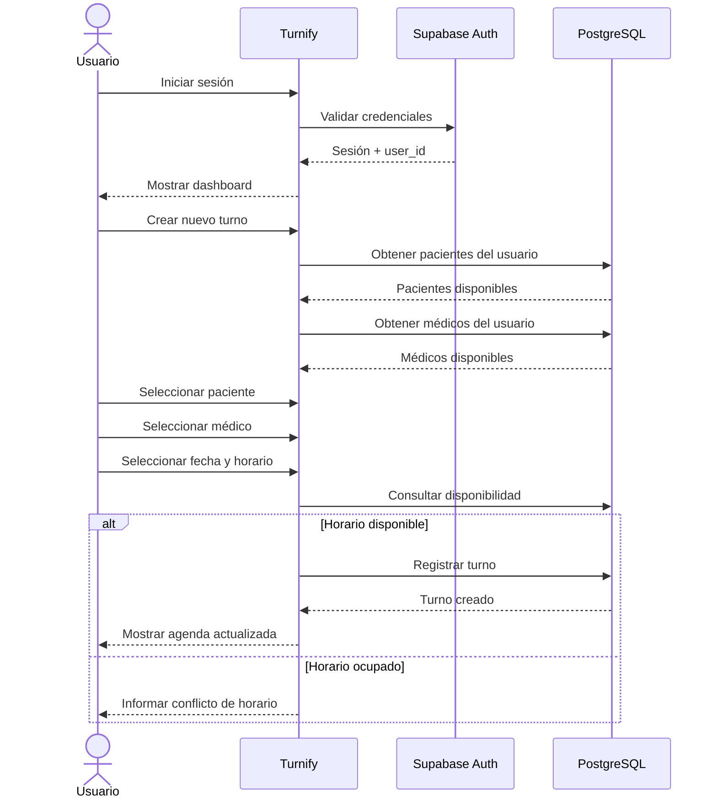
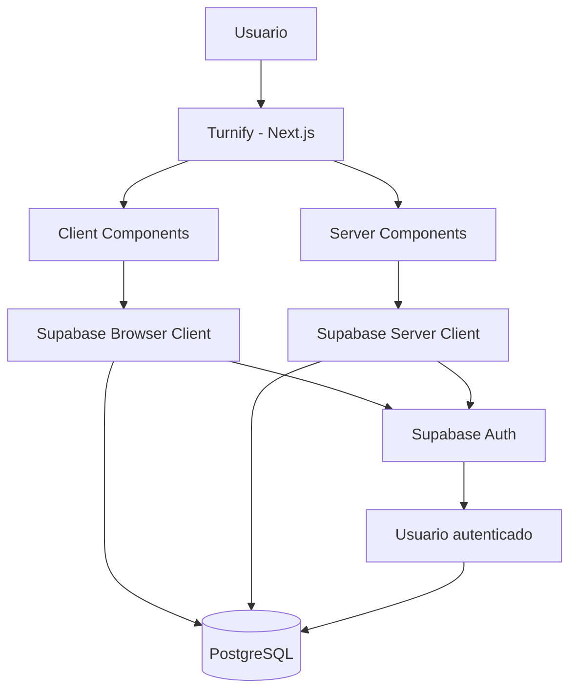
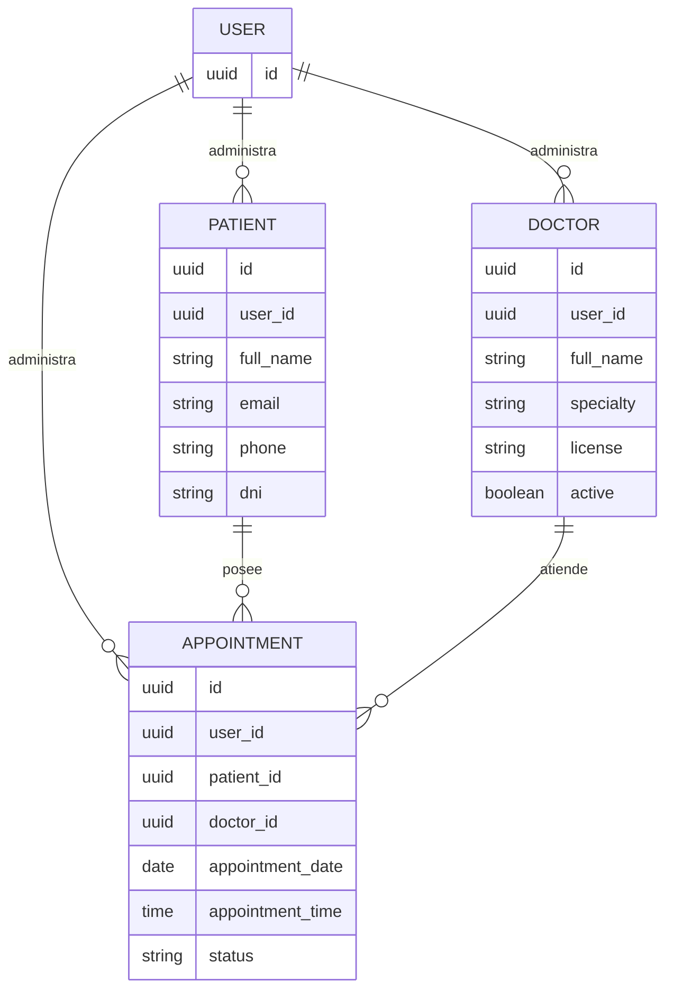
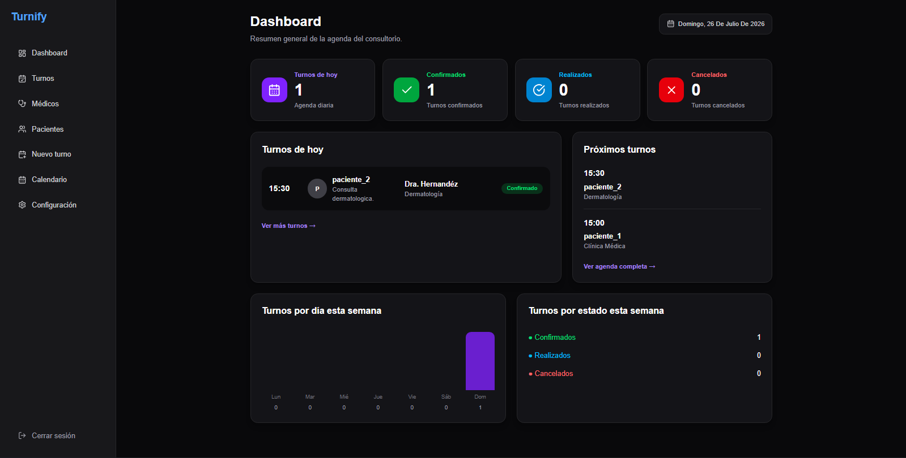
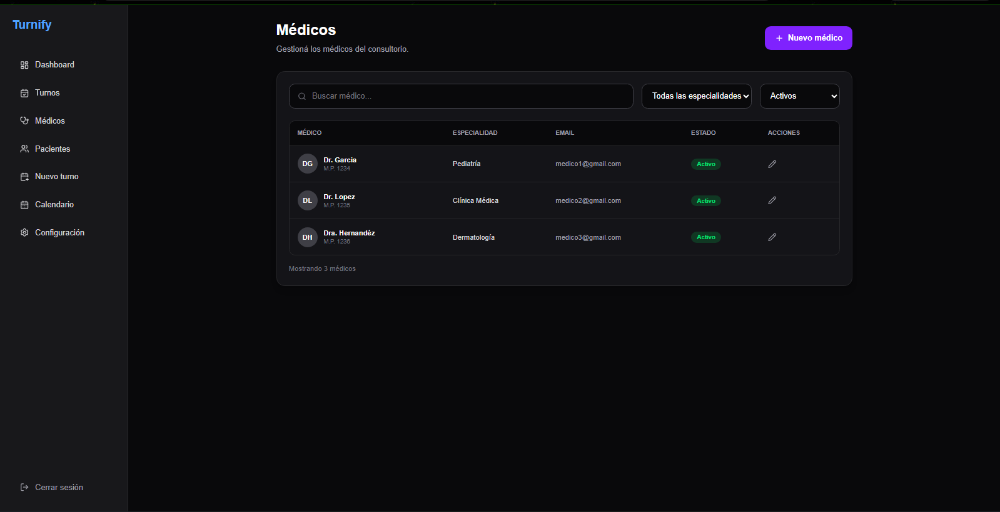
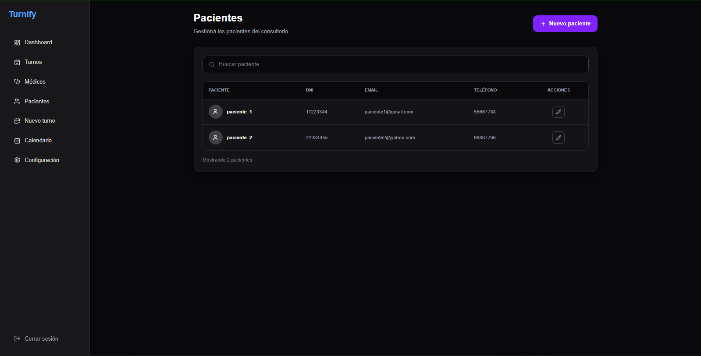
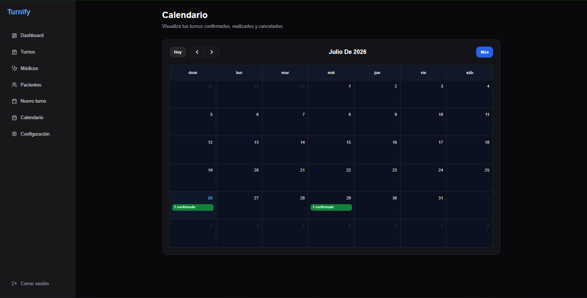
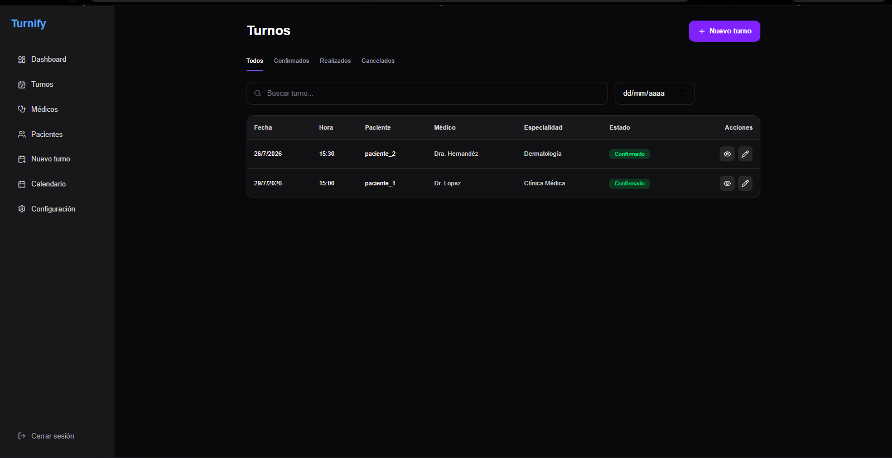
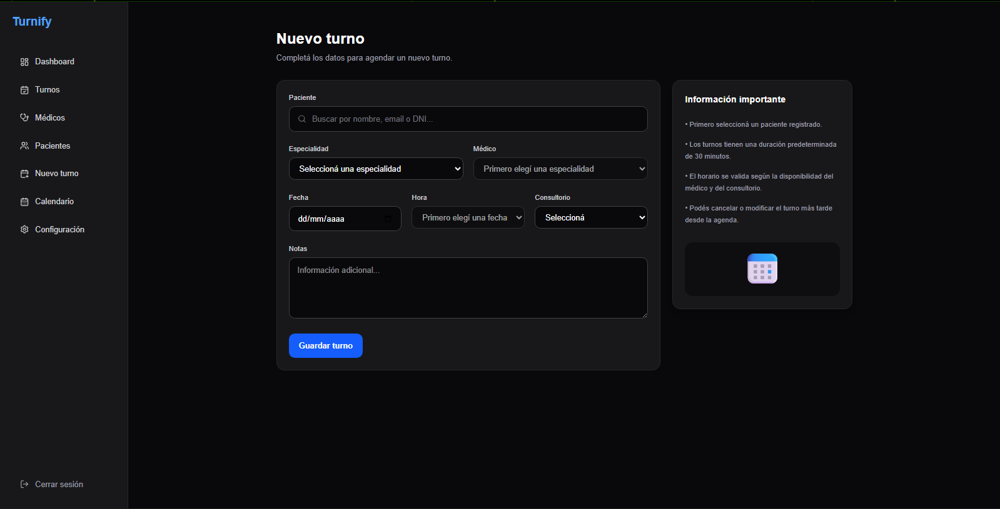

<div align="center">

# 🩺 Turnify

### Gestión de turnos médicos simple, centralizada y multiusuario

Turnify es una aplicación web que permite administrar **médicos, pacientes y turnos** desde un único lugar, incorporando autenticación, calendario, control de disponibilidad y estadísticas.

Desarrollado con **Next.js · TypeScript · Supabase · PostgreSQL · Tailwind CSS**

### 🚀 [Ver Turnify en funcionamiento](https://turnify-five.vercel.app)

</div>

---

# 📖 Sobre Turnify

Turnify nació con el objetivo de resolver un problema cotidiano en la administración de consultorios: gestionar pacientes, profesionales y citas sin depender de información distribuida en diferentes herramientas.

Registrar un turno parece una operación sencilla, pero a medida que aumenta la cantidad de pacientes y profesionales aparecen nuevos problemas: conocer rápidamente la disponibilidad de un médico, evitar superposiciones, consultar las próximas citas, identificar el estado de cada turno y mantener organizada la información de los pacientes.

Turnify centraliza todo este proceso.

Desde una misma aplicación, un usuario puede registrar los profesionales de su consultorio, administrar sus pacientes, programar nuevas citas y visualizar su agenda mediante diferentes perspectivas.

El sistema incorpora además un dashboard que resume la actividad y permite conocer rápidamente el estado actual de la agenda.

---

# 🏥 Un sistema preparado para múltiples consultorios

Uno de los aspectos centrales del proyecto es su funcionamiento **multiusuario**.

Turnify fue diseñado para que diferentes consultorios puedan utilizar la misma aplicación manteniendo sus espacios de trabajo independientes.

Por ejemplo:

```text
Consultorio San Martín
│
├── Médicos
├── Pacientes
└── Turnos


Centro Médico Belgrano
│
├── Médicos
├── Pacientes
└── Turnos
```

Aunque ambos utilizan Turnify y comparten la misma infraestructura, cada cuenta administra únicamente la información que le pertenece.

De esta manera, un profesional registrado por el Consultorio San Martín no aparecerá dentro del Centro Médico Belgrano, y lo mismo ocurre con pacientes y turnos.

Esta separación se consigue utilizando la identidad del usuario autenticado como parte del modelo de datos y de las consultas realizadas a la base.

---

# 💡 ¿Cómo funciona?

El funcionamiento de Turnify parte de una idea sencilla: **pacientes, médicos y turnos no son elementos independientes, sino partes de un mismo flujo de trabajo**.

Primero se registran los pacientes y profesionales del consultorio. Una vez disponibles esos datos, pueden utilizarse para programar citas.

Al crear un turno, el usuario selecciona un paciente existente, el profesional que realizará la atención, la fecha y el horario.

Antes de registrar la cita, Turnify verifica la disponibilidad del médico. Si ese profesional ya posee una reserva para la misma fecha y horario, el sistema impide generar la superposición.

Cuando el horario está disponible, el turno queda registrado y pasa a formar parte de la agenda y del calendario.

Durante su ciclo de vida puede cambiar de estado:

```text
                   ┌──► Realizado
                   │
Confirmado ────────┤
                   │
                   └──► Cancelado
```

Se decidió que los nuevos turnos ingresen directamente como **Confirmados**, ya que dentro del flujo actual la creación de una cita representa la reserva efectiva de ese horario.

---

# 🔄 Flujo principal del sistema

La creación de un turno es uno de los procesos más importantes de Turnify porque combina autenticación, pacientes, médicos, reglas de disponibilidad y persistencia de información.


```mermaid
sequenceDiagram

    actor U as Usuario
    participant T as Turnify
    participant A as Supabase Auth
    participant DB as PostgreSQL

    U->>T: Iniciar sesión
    T->>A: Validar credenciales
    A-->>T: Sesión + user_id
    T-->>U: Mostrar dashboard

    U->>T: Crear nuevo turno

    T->>DB: Obtener pacientes del usuario
    DB-->>T: Pacientes disponibles

    T->>DB: Obtener médicos del usuario
    DB-->>T: Médicos disponibles

    U->>T: Seleccionar paciente
    U->>T: Seleccionar médico
    U->>T: Seleccionar fecha y horario

    T->>DB: Consultar disponibilidad

    alt Horario disponible
        T->>DB: Registrar turno
        DB-->>T: Turno creado
        T-->>U: Mostrar agenda actualizada
    else Horario ocupado
        T-->>U: Informar conflicto de horario
    end
```

La autenticación es fundamental dentro de este proceso.

El `user_id` obtenido mediante Supabase Auth determina qué pacientes, médicos y turnos puede consultar la cuenta activa. Cuando finalmente se registra la cita, el turno también queda asociado a ese usuario.

Esto permite que el mismo flujo pueda ejecutarse simultáneamente en diferentes consultorios sin mezclar información.

---

# 🏗️ Arquitectura

Turnify utiliza **Next.js con App Router** como framework principal y Supabase como plataforma de backend.

Una característica importante de la arquitectura es que la aplicación ejecuta código tanto en el navegador como en el servidor.

Por este motivo, la comunicación con Supabase fue separada según el contexto de ejecución.


```mermaid
flowchart TB

    U[Usuario]

    U --> NEXT[Turnify - Next.js]

    NEXT --> CLIENT[Client Components]
    NEXT --> SERVER[Server Components]

    CLIENT --> BROWSER[Supabase Browser Client]
    SERVER --> SSC[Supabase Server Client]

    BROWSER --> AUTH[Supabase Auth]
    SSC --> AUTH

    BROWSER --> DB[(PostgreSQL)]
    SSC --> DB

    AUTH --> ID[Usuario autenticado]
    ID --> DB
```

Los **Client Components** utilizan un cliente de Supabase pensado para ejecutarse desde el navegador.

Los **Server Components**, en cambio, utilizan un cliente de servidor que recupera la sesión mediante cookies.

Esta separación permite conservar correctamente la autenticación independientemente de dónde se realice la operación.

---

# 🔐 Autenticación y aislamiento de información

Turnify utiliza **Supabase Auth** para el registro, inicio de sesión y manejo de sesiones.

Cuando una persona inicia sesión correctamente, Supabase devuelve la identidad de la cuenta autenticada.

Ese identificador se utiliza posteriormente en las consultas.

Por ejemplo, una consulta de pacientes conceptualmente funciona de la siguiente manera:

```ts
const { data: patients } = await supabase
  .from("patients")
  .select("*")
  .eq("user_id", user.id);
```

La aplicación no solicita todos los pacientes almacenados en la base.

Solicita únicamente aquellos cuyo `user_id` coincide con la cuenta autenticada.

La misma lógica se utiliza para médicos y turnos.

Además del filtrado realizado desde la aplicación, Supabase permite incorporar políticas de **Row Level Security (RLS)** sobre PostgreSQL, agregando una capa de seguridad directamente sobre el acceso a los datos.

---

# 🗄️ Modelo de datos

El modelo de Turnify gira alrededor de tres entidades principales:

**Pacientes, Médicos y Turnos.**

Los turnos relacionan a un paciente con un profesional en una fecha y horario determinados.


```mermaid
erDiagram

    USER ||--o{ PATIENT : administra
    USER ||--o{ DOCTOR : administra
    USER ||--o{ APPOINTMENT : administra

    PATIENT ||--o{ APPOINTMENT : posee
    DOCTOR ||--o{ APPOINTMENT : atiende

    USER {
        uuid id
    }

    PATIENT {
        uuid id
        uuid user_id
        string full_name
        string email
        string phone
        string dni
    }

    DOCTOR {
        uuid id
        uuid user_id
        string full_name
        string specialty
        string license
        boolean active
    }

    APPOINTMENT {
        uuid id
        uuid user_id
        uuid patient_id
        uuid doctor_id
        date appointment_date
        time appointment_time
        string status
    }
```

El campo `user_id` permite determinar a qué cuenta pertenece cada registro.

`patient_id` y `doctor_id`, por otro lado, permiten establecer quién será atendido y qué profesional realizará la atención.

Esta estructura permite mantener una única base de datos sin perder la separación lógica entre los diferentes espacios de trabajo.

---

# 📊 Dashboard

El dashboard funciona como punto de entrada al sistema una vez iniciada la sesión.

Su objetivo no es simplemente mostrar estadísticas, sino permitir que el usuario comprenda rápidamente qué está ocurriendo con su agenda.

Desde allí puede visualizar la actividad del día, los turnos confirmados, realizados y cancelados, además de acceder a las próximas citas.

También se presenta información semanal para ofrecer una perspectiva más amplia de la actividad del consultorio.

<p align="center">
    
</p>

---

# 👨‍⚕️ Gestión de médicos

Turnify permite mantener un registro de los profesionales que trabajan dentro del consultorio.

Cada médico posee información como nombre, correo electrónico, matrícula, especialidad y estado.

Registrar los profesionales independientemente de las citas permite reutilizar su información al programar nuevos turnos y facilita futuras ampliaciones del sistema, como disponibilidad personalizada o agendas individuales.

<p align="center">
    
</p>

---

# 🧑‍🤝‍🧑 Gestión de pacientes

Los pacientes también poseen su propio registro dentro del sistema.

Turnify almacena información como nombre, DNI, correo electrónico y teléfono para evitar que estos datos deban ingresarse nuevamente cada vez que una persona solicita una cita.

Durante la creación de un turno, el sistema permite buscar pacientes existentes por diferentes datos y seleccionarlos directamente.

Esto transforma la creación de citas en un proceso más rápido y reduce la duplicación innecesaria de información.

<p align="center">
    
</p>

---

# 📅 Agenda y calendario

La información de los turnos puede visualizarse de diferentes maneras según la necesidad del usuario.

La agenda permite trabajar con información detallada sobre cada cita, mientras que el calendario ofrece una perspectiva temporal más clara de la actividad mensual.

Desde el calendario es posible identificar rápidamente los días con citas y acceder a la información correspondiente.

<p align="center">
    
</p>
<p align="center">
    
</p>

Estas dos vistas trabajan sobre la misma información almacenada en PostgreSQL, pero la presentan de manera diferente según el contexto de uso.

---

# ✨ Creación de turnos

La creación de turnos conecta las principales funcionalidades del sistema.

En lugar de escribir nuevamente los datos del paciente, el usuario puede buscar uno previamente registrado.

Posteriormente selecciona un médico, fecha y horario.

Antes de completar la operación, Turnify consulta las citas existentes para determinar si ese profesional ya posee una reserva en ese momento.

Si existe una superposición, el turno no se registra y se informa al usuario.

Si el horario se encuentra disponible, la cita se guarda y aparece automáticamente en las diferentes vistas del sistema.

<p align="center">
    
</p>

---

# 🤖 Uso de Inteligencia Artificial durante el desarrollo

La Inteligencia Artificial fue utilizada como una **herramienta de asistencia durante el proceso de desarrollo**, especialmente para debugging, análisis de errores, revisión de código, discusión de alternativas técnicas y documentación.

No se utilizó como un mecanismo para generar el proyecto completo de forma automática.

La metodología consistió en trabajar sobre problemas concretos: identificar el comportamiento incorrecto, proporcionar el código involucrado, analizar las posibles causas y soluciones propuestas por la IA y posteriormente adaptar esas soluciones al proyecto.

Cada modificación era finalmente probada sobre Turnify antes de considerarse resuelto el problema.

## Un caso concreto: convertir Turnify en multiusuario

Uno de los problemas más importantes apareció cuando la aplicación comenzó a incorporar múltiples cuentas.

La autenticación funcionaba, pero no era suficiente simplemente con saber que una persona había iniciado sesión. También era necesario garantizar que todas las consultas utilizaran correctamente esa identidad.

Durante esta etapa utilicé IA para analizar el funcionamiento de las sesiones de Supabase dentro de Next.js y comprender las diferencias entre operaciones realizadas desde **Client Components** y **Server Components**.

El análisis permitió detectar la necesidad de separar la creación de los clientes de Supabase:

```text
Browser Supabase Client
        │
        └── Componentes ejecutados en el navegador


Server Supabase Client
        │
        └── Componentes ejecutados en el servidor
            └── Recuperación de sesión mediante cookies
```

Posteriormente incorporé el `user_id` en las operaciones relacionadas con pacientes, médicos y turnos.

La implementación fue validada utilizando cuentas diferentes. Se comprobó que cada una pudiera crear sus propios registros y que, al cambiar de usuario, no fuera posible visualizar la información perteneciente a la otra cuenta.

## Otros usos de IA

También utilicé IA como apoyo para analizar errores de TypeScript y Next.js, revisar consultas realizadas a Supabase, resolver problemas de autenticación durante el despliegue en Vercel y evaluar determinadas decisiones de interfaz y lógica de negocio.

Además, fue utilizada como asistencia para estructurar y revisar esta documentación.

En todos los casos, la IA funcionó como una herramienta para **acelerar el análisis y explorar soluciones**, mientras que las decisiones finales, integración del código y pruebas se realizaron sobre el proyecto.

---

# 🧩 Desafíos y decisiones técnicas

Durante el desarrollo aparecieron situaciones que obligaron a modificar la arquitectura inicial del proyecto.

Una de las más importantes fue la incorporación del modelo multiusuario.

No alcanzaba con agregar un sistema de login. También fue necesario modificar las entidades y consultas para asociar correctamente los registros con la cuenta propietaria.

Otro desafío estuvo relacionado con la autenticación entre cliente y servidor. Durante las pruebas, una sesión podía existir correctamente en el navegador pero no estar disponible de la misma forma dentro de un Server Component.

Esto llevó a separar los clientes de Supabase y utilizar cookies para recuperar la sesión desde el servidor.

La validación de disponibilidad de los médicos fue otra decisión de negocio importante. Turnify consulta los turnos existentes antes de registrar una nueva cita para evitar que un profesional pueda recibir dos reservas simultáneas.

Finalmente, el despliegue en Vercel requirió configurar correctamente las variables de entorno utilizadas para conectar la aplicación publicada con Supabase.

Estos desafíos hicieron que el desarrollo involucrara no solamente la creación de una interfaz, sino también decisiones relacionadas con arquitectura, autenticación, seguridad y persistencia de datos.

---

# 🛠️ Tecnologías utilizadas

### Next.js + React

Constituyen la base de la aplicación y permiten combinar interfaces interactivas con renderizado del lado del servidor.

### TypeScript

Permite incorporar tipado estático y detectar determinados errores durante el desarrollo y proceso de build.

### Supabase

Se utiliza para autenticación, manejo de sesiones y comunicación con la base de datos.

### PostgreSQL

Almacena pacientes, médicos y turnos, además de las relaciones necesarias para mantener los espacios de trabajo independientes.

### Tailwind CSS

Se utiliza para construir y mantener la interfaz visual de Turnify.

### FullCalendar

Permite representar los turnos mediante una vista de calendario.

### Lucide React

Proporciona los iconos utilizados en la interfaz.

### Vercel

Turnify se encuentra desplegado en Vercel y conectado con el repositorio del proyecto.

---

# 📂 Estructura del proyecto

```text
turnify/
│
├── src/
│   │
│   ├── app/
│   │   ├── appointments/
│   │   ├── calendar/
│   │   ├── dashboard/
│   │   ├── doctors/
│   │   ├── patients/
│   │   ├── login/
│   │   └── register/
│   │
│   ├── components/
│   │   ├── calendar/
│   │   ├── AppLayout.tsx
│   │   ├── AuthGuard.tsx
│   │   └── ...
│   │
│   └── lib/
│       ├── supabaseBrowser.ts
│       └── supabaseServer.ts
│
├── docs/
│
├── public/
│
└── README.md
```

La carpeta `app` contiene las rutas principales del sistema.

Los elementos reutilizables de interfaz y comportamiento se encuentran dentro de `components`, mientras que `lib` contiene la configuración necesaria para comunicarse con Supabase.

---

# 🚀 Ejecutar el proyecto localmente

Primero se debe clonar el repositorio:

```bash
git clone https://github.com/RocioAranibar/turnify.git
```

Ingresar al proyecto:

```bash
cd turnify
```

Instalar las dependencias:

```bash
npm install
```

Crear un archivo `.env.local` en la raíz:

```env
NEXT_PUBLIC_SUPABASE_URL=TU_SUPABASE_URL
NEXT_PUBLIC_SUPABASE_PUBLISHABLE_KEY=TU_SUPABASE_PUBLISHABLE_KEY
```

Finalmente ejecutar:

```bash
npm run dev
```

La aplicación estará disponible normalmente en:

```text
http://localhost:3000
```

Las credenciales reales utilizadas por el proyecto no se incluyen en el repositorio y deben configurarse mediante variables de entorno.

---

# 🌐 Deploy

Turnify se encuentra desplegado en Vercel:

### 🚀 https://turnify-five.vercel.app

El proyecto está conectado con el repositorio de GitHub, permitiendo mantener actualizada la versión publicada a medida que evoluciona la aplicación.

---

# 🔮 Próximos pasos

Turnify actualmente cubre el flujo central de administración de una agenda médica: autenticación, pacientes, profesionales, turnos, estados, calendario y estadísticas.

La arquitectura actual permite continuar evolucionando el proyecto.

Entre las posibles extensiones se encuentran la incorporación de roles internos para administradores, recepcionistas y médicos; configuración de días y horarios de atención por profesional; recordatorios automáticos; obras sociales; historial de pacientes; reportes y notificaciones.

El objetivo sería evolucionar Turnify desde un sistema de gestión de turnos hacia una plataforma más completa para la administración cotidiana de consultorios.

---

# 👩‍💻 Autora

**Rocío Aranibar**

Turnify fue desarrollado como challenge técnico, abarcando diseño de interfaz, lógica de negocio, autenticación, modelado de datos, integración con Supabase, seguridad multiusuario y despliegue.

### 🔗 Demo
https://turnify-five.vercel.app

### 🔗 Repositorio
https://github.com/RocioAranibar/turnify
