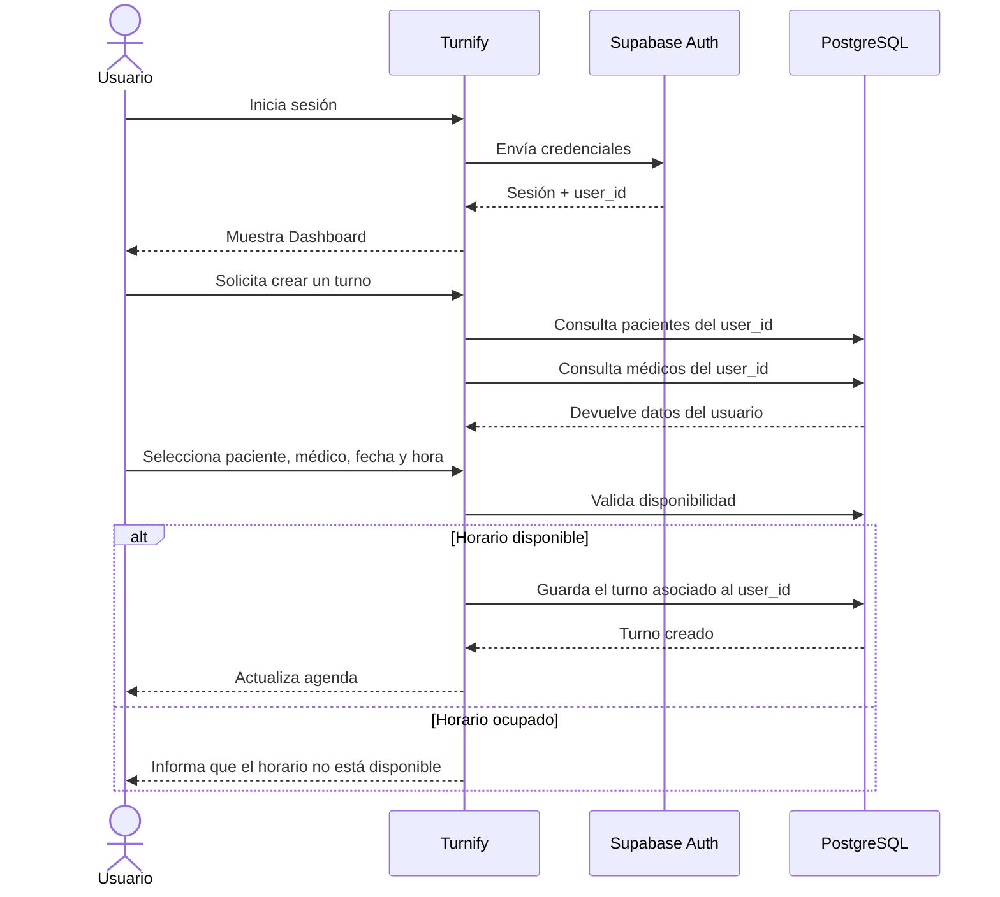
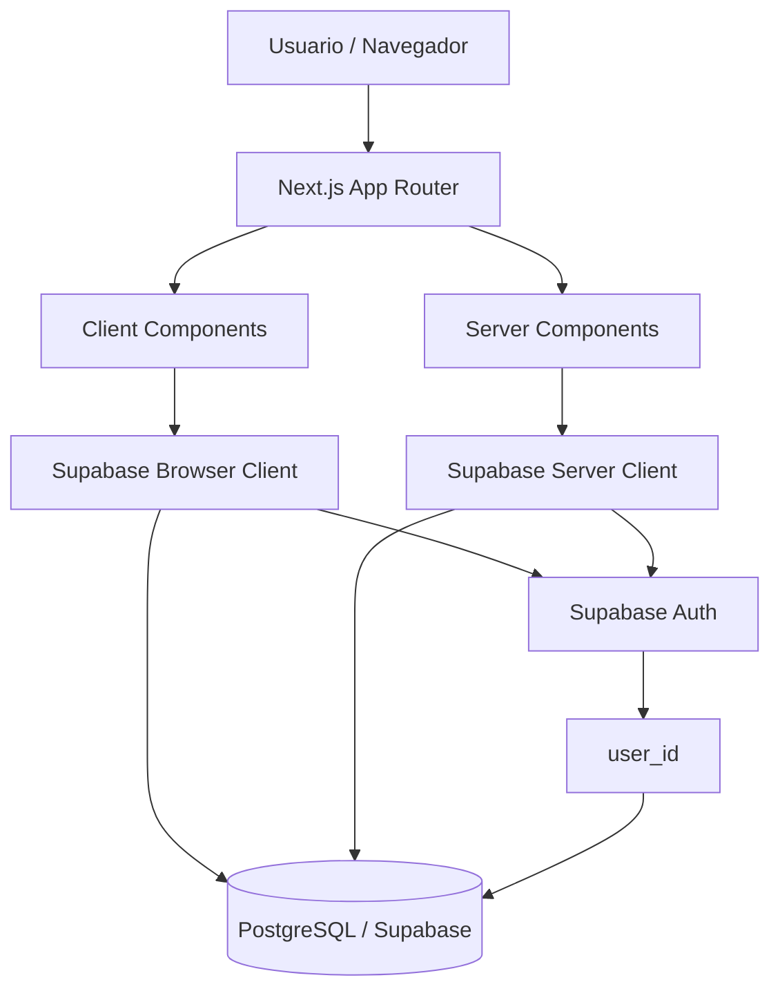
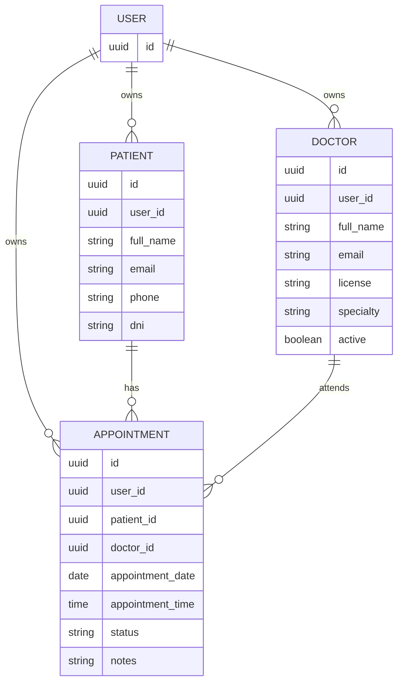

<div align="center">

# 🩺 Turnify

### Sistema web de gestión de turnos médicos

Turnify es una aplicación web multiusuario diseñada para centralizar la gestión de turnos, pacientes y profesionales de un consultorio médico.

Desarrollada con **Next.js, TypeScript, Supabase y PostgreSQL**.

**Demo online:** https://turnify-five.vercel.app

</div>

---

## 📖 Sobre el proyecto

Turnify nació con el objetivo de resolver un problema cotidiano en la administración de un consultorio: organizar pacientes, profesionales y turnos desde un único lugar, evitando depender de agendas separadas o registros manuales.

La aplicación permite que un usuario cree una cuenta y disponga de su propio espacio de trabajo. Desde allí puede registrar médicos y pacientes, asignar turnos, consultar la agenda mensual y visualizar información resumida desde un dashboard.

Uno de los principales objetivos técnicos del proyecto fue convertir el sistema en una aplicación **multiusuario real**. Esto significa que dos personas pueden registrarse y utilizar Turnify simultáneamente, pero cada una administra únicamente sus propios médicos, pacientes y turnos.

Por ejemplo, si dos administradores distintos crean una cuenta:

```text
Cuenta Rocío
├── Pacientes de Rocío
├── Médicos de Rocío
└── Turnos de Rocío

Cuenta Juan
├── Pacientes de Juan
├── Médicos de Juan
└── Turnos de Juan
```

La separación se realiza utilizando el identificador generado por **Supabase Auth (`user_id`)**, que permite relacionar cada registro con el usuario que lo creó.

---

## 🎯 ¿Qué problema busca resolver?

La administración de turnos requiere manejar varias entidades relacionadas entre sí: quién es el paciente, qué profesional lo atenderá, cuándo será la consulta y cuál es el estado actual del turno.

Turnify concentra esa información en una misma aplicación.

En lugar de tratar los turnos como registros independientes, el sistema relaciona **usuarios, pacientes, médicos y citas**, permitiendo consultar la información desde diferentes perspectivas: una tabla de turnos, un calendario mensual o un dashboard con estadísticas.

La aplicación también contempla el ciclo de vida de una cita. Un turno comienza como **confirmado** y posteriormente puede pasar a **realizado** o **cancelado**.

---

## 🌐 Demo

La aplicación se encuentra desplegada en Vercel:

**https://turnify-five.vercel.app**

La demo permite crear una cuenta propia, iniciar sesión y utilizar las funcionalidades del sistema.

Al tratarse de una aplicación multiusuario, una cuenta nueva comienza con su propio conjunto de médicos, pacientes y turnos, sin acceder a los datos registrados por otras cuentas.

---

# 📸 Interfaz

## Dashboard

El dashboard funciona como punto de entrada al sistema. Resume la actividad del consultorio y permite conocer rápidamente la cantidad de turnos del día y sus diferentes estados.

<p align="center">
  
</p>

## Gestión de turnos

Desde esta pantalla se puede consultar la agenda, buscar turnos y acceder al detalle de cada cita.

<p align="center">
  
</p>

## Nuevo turno

La creación de un turno relaciona tres elementos principales: paciente, médico y horario.

<p align="center">
  
</p>

## Pacientes

Los pacientes pueden registrarse y posteriormente ser buscados al momento de crear una cita.

<p align="center">
  
</p>

## Médicos

Cada cuenta puede administrar los profesionales que posteriormente estarán disponibles para asignar a los turnos.

<p align="center">
  
</p>

## Calendario

El calendario ofrece una segunda forma de visualizar la agenda, agrupando los turnos por fecha y estado.

<p align="center">
  
</p>

---

# 🔄 Flujo principal del sistema

El flujo habitual comienza con la autenticación del usuario. Una vez iniciada la sesión, Turnify obtiene la identidad proporcionada por Supabase Auth y utiliza ese identificador para consultar solamente la información correspondiente a esa cuenta.

Antes de crear un turno se registran los médicos y pacientes. Posteriormente, al generar una cita, el usuario selecciona un paciente, un profesional, una fecha y un horario. El turno queda asociado tanto a esas entidades como al usuario autenticado.

El siguiente diagrama representa ese proceso:


```mermaid
sequenceDiagram
    actor U as Usuario
    participant T as Turnify
    participant A as Supabase Auth
    participant DB as PostgreSQL

    U->>T: Inicia sesión
    T->>A: Envía credenciales
    A-->>T: Sesión + user_id
    T-->>U: Muestra Dashboard

    U->>T: Solicita crear un turno
    T->>DB: Consulta pacientes del user_id
    T->>DB: Consulta médicos del user_id
    DB-->>T: Devuelve datos del usuario

    U->>T: Selecciona paciente, médico, fecha y hora
    T->>DB: Valida disponibilidad

    alt Horario disponible
        T->>DB: Guarda el turno asociado al user_id
        DB-->>T: Turno creado
        T-->>U: Actualiza agenda
    else Horario ocupado
        T-->>U: Informa que el horario no está disponible
    end
```

---

# 🏗️ Arquitectura

Turnify fue desarrollado utilizando **Next.js App Router**.

La aplicación combina componentes ejecutados en el navegador con componentes ejecutados en el servidor. Para mantener correctamente la sesión de Supabase en ambos contextos se utilizan clientes específicos para navegador y servidor.


```mermaid
flowchart TD
    U[Usuario / Navegador]

    U --> NEXT[Next.js App Router]

    NEXT --> CLIENT[Client Components]
    NEXT --> SERVER[Server Components]

    CLIENT --> BROWSER[Supabase Browser Client]
    SERVER --> SSR[Supabase Server Client]

    BROWSER --> AUTH[Supabase Auth]
    SSR --> AUTH

    BROWSER --> DB[(PostgreSQL / Supabase)]
    SSR --> DB

    AUTH --> UID[user_id]
    UID --> DB
```

Esta separación fue especialmente importante durante la implementación del sistema multiusuario. Las operaciones realizadas desde componentes cliente necesitan conocer la sesión del navegador, mientras que las páginas renderizadas en servidor deben recuperar esa misma sesión mediante cookies.

Para resolverlo se utilizan clientes diferenciados:

```text
src/lib/
├── supabaseBrowser.ts
└── supabaseServer.ts
```

De esta manera, la autenticación permanece disponible independientemente del contexto desde el que se realiza una consulta.

---

# 🗄️ Modelo de datos

El modelo se centra en tres entidades principales: **pacientes, médicos y turnos**.


```mermaid
erDiagram

    USER ||--o{ PATIENT : owns
    USER ||--o{ DOCTOR : owns
    USER ||--o{ APPOINTMENT : owns

    PATIENT ||--o{ APPOINTMENT : has
    DOCTOR ||--o{ APPOINTMENT : attends

    USER {
        uuid id
    }

    PATIENT {
        uuid id
        uuid user_id
        string full_name
        string email
        string phone
        string dni
    }

    DOCTOR {
        uuid id
        uuid user_id
        string full_name
        string email
        string license
        string specialty
        boolean active
    }

    APPOINTMENT {
        uuid id
        uuid user_id
        uuid patient_id
        uuid doctor_id
        date appointment_date
        time appointment_time
        string status
        string notes
    }
```

El campo `user_id` cumple un papel central en el diseño. No solamente identifica quién creó un registro, sino que permite utilizar una única base de datos manteniendo separados los datos correspondientes a cada cuenta.

---

# 🔐 Autenticación y aislamiento de datos

La autenticación se implementó mediante **Supabase Auth**.

Cuando una persona inicia sesión, Supabase proporciona un usuario autenticado con un identificador único. Ese identificador se utiliza al crear médicos, pacientes y turnos.

Por ejemplo, conceptualmente una consulta de pacientes sigue esta lógica:

```ts
const { data: patients } = await supabase
  .from("patients")
  .select("*")
  .eq("user_id", user.id);
```

Por lo tanto, aunque existan pacientes pertenecientes a diferentes cuentas dentro de la base de datos, la aplicación solicita únicamente los correspondientes al usuario actual.

Además, el proyecto utiliza **Row Level Security (RLS)** en Supabase como parte de la estrategia de protección de datos.

La combinación de autenticación, filtrado por `user_id`, protección de rutas y RLS permite implementar el comportamiento multiusuario del sistema.

---

# 📅 Gestión de turnos

La gestión de turnos constituye el núcleo de Turnify.

Para crear una cita primero debe existir un paciente y un médico. En lugar de mostrar una lista extensa de pacientes, el formulario utiliza una búsqueda dinámica por nombre, correo electrónico o DNI. Los resultados se limitan a los pacientes pertenecientes al usuario autenticado.

El profesional también se obtiene del conjunto de médicos correspondiente a esa cuenta.

Antes de registrar la cita, Turnify verifica que no exista otro turno para el mismo médico, fecha y horario. Esto evita generar dos reservas simultáneas para un mismo profesional.

Los estados utilizados actualmente son:

| Estado | Significado |
|---|---|
| **Confirmado** | El horario se encuentra reservado para el paciente |
| **Realizado** | La atención ya fue efectuada |
| **Cancelado** | El turno fue cancelado |

Se decidió eliminar el estado **Pendiente** porque, dentro del flujo actual del sistema, la creación de una cita representa directamente la confirmación y reserva del horario.

---

# 👥 Gestión de pacientes

Los pacientes se administran independientemente de los turnos. Esto permite registrar una persona una sola vez y reutilizar su información en futuras citas.

Cada paciente puede contener nombre completo, DNI, correo electrónico y teléfono.

Al crear un turno, el usuario no necesita volver a ingresar manualmente todos esos datos: puede buscar al paciente existente y seleccionarlo.

La búsqueda fue diseñada para evitar desplegar una lista completa cuando el consultorio acumule una cantidad elevada de pacientes.

---

# 👨‍⚕️ Gestión de médicos

El módulo de médicos permite registrar los profesionales disponibles en la agenda junto con información como nombre, matrícula, correo electrónico, especialidad y estado.

Los médicos también están asociados al `user_id`, por lo que una cuenta no puede utilizar los profesionales registrados por otra.

Esta relación también permite que la validación de disponibilidad de turnos se realice sobre un profesional específico.

---

# 📊 Dashboard y calendario

El dashboard busca responder rápidamente preguntas operativas como:

- ¿Cuántos turnos hay hoy?
- ¿Cuántos fueron confirmados?
- ¿Cuántos fueron realizados?
- ¿Cuántos fueron cancelados?
- ¿Cuáles son las próximas citas?

Además de la tabla tradicional de turnos, Turnify incorpora un calendario mensual mediante **FullCalendar**.

El calendario agrupa los turnos por día y permite visualizar sus estados. Al seleccionar una fecha, el usuario puede acceder al listado de turnos correspondiente a ese día.

De esta forma, la misma información puede analizarse tanto desde una perspectiva detallada como temporal.

---

# 🧠 Uso de Inteligencia Artificial durante el desarrollo

Durante el desarrollo de Turnify utilicé herramientas de Inteligencia Artificial como **asistente de desarrollo**, principalmente para analizar alternativas de implementación, revisar fragmentos de código, detectar errores y mejorar la documentación técnica.

La IA no fue utilizada simplemente para generar el proyecto completo. El proceso consistió en plantear problemas concretos, analizar las propuestas obtenidas, adaptarlas a la arquitectura existente y posteriormente probar su funcionamiento.

Uno de los casos donde este proceso tuvo mayor importancia fue la implementación del sistema multiusuario.

Inicialmente, distintas partes de la aplicación utilizaban un único cliente de Supabase. Al comenzar a separar la información por usuario aparecieron diferencias entre la sesión disponible en componentes ejecutados en el navegador y las páginas ejecutadas en el servidor.

La IA fue utilizada como apoyo para analizar ese comportamiento y evaluar alternativas. La solución finalmente implementada consistió en separar la creación del cliente de Supabase según el contexto:

```text
supabaseBrowser.ts → operaciones ejecutadas en el navegador
supabaseServer.ts  → operaciones ejecutadas en el servidor
```

Después de implementar los cambios realicé pruebas utilizando diferentes cuentas para verificar que cada una pudiera visualizar únicamente sus propios médicos, pacientes y turnos.

También utilicé IA durante tareas de debugging. Algunos ejemplos fueron:

- análisis de errores de autenticación y persistencia de sesión;
- revisión de consultas a Supabase;
- detección de problemas durante el despliegue en Vercel;
- revisión de validaciones de formularios;
- discusión de decisiones de UX, como los estados posibles de un turno;
- asistencia para estructurar y mejorar la documentación.

En todos estos casos, las respuestas generadas fueron tomadas como propuestas de solución y posteriormente revisadas y probadas dentro del proyecto.

Esta forma de trabajo me permitió utilizar IA como una herramienta adicional dentro del proceso de desarrollo, manteniendo la validación técnica y las decisiones finales sobre la implementación.

---

# 🧩 Principales desafíos técnicos

## Autenticación entre cliente y servidor

Uno de los principales desafíos apareció al incorporar autenticación SSR.

El login funcionaba correctamente desde el navegador, pero determinadas páginas ejecutadas en el servidor no podían recuperar la misma sesión.

Esto llevó a diferenciar explícitamente el cliente de Supabase utilizado en cada contexto y a manejar la sesión mediante cookies para los Server Components.

## Conversión a sistema multiusuario

La primera versión del proyecto permitía administrar turnos, pero el siguiente paso fue garantizar que la aplicación pudiera ser utilizada por diferentes cuentas.

Para lograrlo fue necesario incorporar `user_id` en las entidades principales y modificar tanto las consultas como las operaciones de inserción.

El resultado es que una misma instancia de Turnify puede ser utilizada por múltiples usuarios manteniendo sus datos separados.

## Diseño de los estados

Inicialmente se contempló un estado `pending`. Sin embargo, al analizar el flujo funcional surgió una pregunta: si crear un turno ya reserva el horario de un profesional, ¿qué representa realmente que esté pendiente?

Se decidió simplificar el modelo a:

```text
Confirmado → Realizado
     │
     └────→ Cancelado
```

Esta decisión evita reservar horarios con un estado ambiguo y simplifica la gestión de la agenda.

## Despliegue

Durante el despliegue se configuraron las variables de entorno necesarias para conectar la aplicación publicada en Vercel con Supabase.

Esto permitió mantener las credenciales fuera del repositorio y utilizar la misma arquitectura tanto en desarrollo local como en producción.

---

# ⚙️ Tecnologías y decisiones

| Tecnología | Uso en Turnify |
|---|---|
| **Next.js** | Framework principal y App Router |
| **React** | Construcción de componentes interactivos |
| **TypeScript** | Tipado del código y modelos utilizados por los componentes |
| **Tailwind CSS** | Construcción de la interfaz |
| **Supabase Auth** | Registro, login y manejo de usuarios |
| **Supabase / PostgreSQL** | Persistencia de médicos, pacientes y turnos |
| **FullCalendar** | Visualización mensual de la agenda |
| **Lucide React** | Iconografía |
| **Vercel** | Despliegue de la aplicación |

Supabase resultó especialmente conveniente para este proyecto porque permitió utilizar una base PostgreSQL junto con autenticación y políticas de acceso dentro del mismo servicio.

Next.js, por otra parte, permitió trabajar con componentes de cliente y servidor y organizar cada módulo utilizando App Router.

---

# 📂 Organización del proyecto

```text
src/
│
├── app/
│   ├── appointments/
│   ├── calendar/
│   ├── dashboard/
│   ├── doctors/
│   ├── login/
│   ├── patients/
│   └── register/
│
├── components/
│   ├── calendar/
│   ├── AppLayout.tsx
│   ├── AuthGuard.tsx
│   └── ...
│
└── lib/
    ├── supabaseBrowser.ts
    └── supabaseServer.ts
```

La carpeta `app` contiene las diferentes rutas funcionales del sistema, mientras que `components` concentra elementos reutilizables de interfaz.

La capa `lib` centraliza la configuración necesaria para comunicarse con Supabase desde los distintos contextos de ejecución.

---

# 🚀 Ejecución local

### Requisitos

Es necesario disponer de Node.js y de un proyecto de Supabase configurado.

### 1. Clonar el repositorio

```bash
git clone https://github.com/RocioAranibar/turnify.git
cd turnify
```

### 2. Instalar las dependencias

```bash
npm install
```

### 3. Configurar las variables de entorno

Crear `.env.local` en la raíz:

```env
NEXT_PUBLIC_SUPABASE_URL=TU_SUPABASE_URL
NEXT_PUBLIC_SUPABASE_PUBLISHABLE_KEY=TU_SUPABASE_PUBLISHABLE_KEY
```

> Las claves reales no deben almacenarse en el repositorio.

### 4. Ejecutar el servidor de desarrollo

```bash
npm run dev
```

La aplicación estará disponible normalmente en:

```text
http://localhost:3000
```

---

# 🔮 Posibles evoluciones

Turnify actualmente cubre el flujo principal de administración de una agenda médica. A partir de esta base, el proyecto podría evolucionar incorporando recordatorios automáticos, disponibilidad configurable por profesional, diferentes roles dentro de un consultorio, obras sociales, reportes y eventualmente funcionalidades relacionadas con la historia clínica.

Otro posible paso sería ampliar el modelo actual para que una misma organización pueda incorporar varios usuarios internos —por ejemplo administradores, secretarios y profesionales— manteniendo permisos diferenciados.

---

# 👩‍💻 Autora

**Rocío Aranibar**

Turnify fue desarrollado como proyecto web full-stack utilizando Next.js, TypeScript y Supabase, abarcando diseño de interfaz, modelado de datos, autenticación, lógica multiusuario y despliegue.

**Repositorio:** https://github.com/RocioAranibar/turnify  
**Demo:** https://turnify-five.vercel.app
